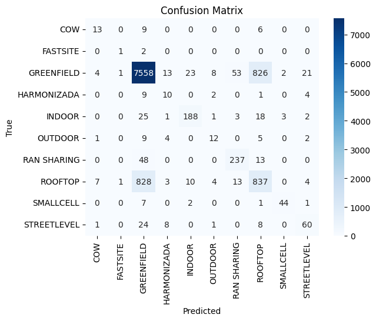

# Telecom Site Type Classifier


A project that predicts telecom site types based on all Brazilian telecom stations data from Anatel, using machine learning.

## Abstract

The Telecom Site Type Classifier project is a machine learning initiative that endeavors to predict various types of telecom sites in Brazil using data sourced from the Brazilian National Telecommunications Agency (Anatel). Targeting site classifications such as GREENFIELD, ROOFTOP, RAN SHARING, STREETLEVEL, INDOOR, OUTDOOR, HARMONIZADA, SMALLCELL, COW, and FASTSITE, the project seeks to automate and enhance the efficiency of the telecom site classification process. By leveraging relevant features extracted from the Anatel dataset, the project contributes to a deeper understanding of the Brazilian telecom landscape. Users can engage with the project by cloning the repository, installing dependencies, and executing provided scripts for dataset preprocessing, transformation, and exploration.

**Keywords:** Telecom Site Classification, Machine Learning, Anatel Dataset, Decision Tree Model, Data Exploration, Automation, Brazilian Telecommunications.

## Overview

The Telecom Site Type Classifier project utilizes machine learning techniques to predict the type of telecom sites present in Brazil:
- GREENFIELD     
- ROOFTOP        
- RAN SHARING     
- STREETLEVEL      
- INDOOR 
- OUTDOOR           
- HARMONIZADA         
- SMALLCELL   
- COW
- FASTSITE
The goal is to automate the site type classification process based on relevant features found in the Anatel data.

## Using this Repository

1. Clone this repository:

   ```shell
   git clone https://github.com/AlexFidalgo/TelecomSiteTypeClassifier.git
   cd TelecomSiteTypeClassifier
   ```

2. Install the necessary dependencies (Python and required libraries).

3. Run the `notebooks/main.py` script to download and preprocess the dataset:

   ```shell
   python notebooks/main.py
   ```

   The `main.py` script will perform the following steps:
   - Create a directory named `data` at the main location of the project.
   - Execute the `download.ps1` PowerShell script, which downloads all data from [Anatel](https://sistemas.anatel.gov.br/se/public/view/b/licenciamento.php?view=licenciamento) into zip files in the `zip_files` directory, one state at a time (which is a requirement imposed by the website).
   - Unzip these files to CSV files under the `csv_files` directory.
   - Delete the downloaded zip files.
   - Execute the `transform_data.py` script, which processes the columns.
   - Execute the `aggregate_data.py` script, which appropriately groups the data by station.

4. Explore the data using the `explore_data.ipynb` Jupyter notebook.

5. Run ML algorithms.

   #### Running Machine Learning Analyses

   1. Run `ML_algorithms/DecisionTree/decision_tree.py` to perform a classification based on the Decision Tree model. You may explore it and play with the parameters and features by using the `DecisionTree/visualizer.ipynb`.


## Methodology
Anatel has a dataset containing information about all legal telecomunication stations in Brazil, which can be found [here](https://sistemas.anatel.gov.br/se/public/view/b/licenciamento.php?view=licenciamento). Each row of the dataset represents a telecomunication transmitter, present in a station.

### Columns

   From [Página de Emissões - Anatel](https://sistemas.anatel.gov.br/anexar-api/publico/anexos/download/9cfc11fc83fcfc2d2586cdb887f72cb5), we can understand what each column refers to.

   1. **Status.state**: Status of the request at Anatel.

   2. **NumFistel**: numeric code defined by Anatel, consisting of eleven digits that identifies the authorization the company has for a specific service in a particular region.

   3. **NomeEntidade**: Name of the company that owns the station.

   4. **SiglaUf**: State code.

   5. **CodMunicipio**: Municipality code.

   6. **NumServico**: Code of the telecommunications service at Anatel.

   7. **NumAto**: Number of the Radiofrequency Authorization Act, with the last four digits referring to the year of the respective act's signature. e.g. XYZW2017, act XYZW of 2017.

   8. **EnderecoEstacao**: Complete address where the station is installed.

   9. **EndComplemento**: Address complement, if applicable.

   10. **DesignacaoEmissao**: Based on [Método de Designação - Anatel](https://www.anatel.gov.br/Portal/verificaDocumentos/documento.asp?numeroPublicacao=60403&assuntoPublicacao=null&caminhoRel=null&filtro=1&documentoPath=outros/autocadastramento/metodo_de_designacao.pdf). Emission designation. For a complete emission designation, we always need 9 alphanumeric characters. The first four represent the _necessary bandwidth_; the next three represent the _basic characteristics_, and the last two represent the _optional additional characteristics_.
      8a) **Necessary bandwidth** For a given emission class, the minimum value of the bandwidth occupied by the emission, sufficient to ensure the transmission of information at the required speed and quality for the employed system, under specified conditions. The necessary bandwidth will always be expressed by three digits, indicating the first three significant digits of the necessary bandwidth and a letter that occupies the position of the decimal point and represents the bandwidth unit, which will be H for Hertz, K for Kilohertz, M for Megahertz, or G for Gigahertz.
      8b) **Basic characteristics** described by three symbols:
         - First symbol: type of modulation.
         - Second symbol:  nature of the signal(s) that modulate.
         - Third symbol: type of information to be transmitted.
      8c) **Optional additional characteristics** or a more complete description of an emission, two optional characteristics are provided, which are expressed by the fourth and fifth symbols. When the fourth or fifth symbol is not used, it is advisable to indicate this with a dash where each symbol would appear.

   11. **Tecnologia**: Technology, options are WCDMA (3G); GSM (2G); HSPA; EDGE; LTE (4G); NR(5G).

   12. **tipoTecnologia**: Whether standalone (SA) or non-standalone (NSA).

   13. **meioAcesso** Field of 'stations exempted from licensing.' The options are: fiber, metallic pair, coaxial cable, and restricted radiation.

   14. **Azimute** Positioning in degrees relative to the North of the main radiation lobe of the antenna. When an omnidirectional antenna is used, it will be 0.

   15. **CodTipoClasseEstacao** Station Class according to the list allowed in the Mosaic channelization system, according to the Regulation of the frequency range used according to the Technical Projects Manual of SITAR, available in [Manual de Projeto - Anatel](https://www.anatel.gov.br/Portal/verificaDocumentos/documento.asp?numeroPublicacao=60402&assuntoPublicacao=MANUAL%20DE%20PROJETOS%20T%C9CNICOS%20(SITAR)&caminhoRel=CidadaoComunica%E7%E3o%20via%20R%E1dioServi%E7o%20Limitado&filtro=1&documentoPath=outros/). Examples:
      - ML: Estação móvel terrestre
      - FX: Estação fixa
      - FB: Estação de base
      - XR: Estação fixa repetidora
      - FA: Estação aeronáutica
      - RC: Radiofarol não direcional

   16. **ClassInfraFisica** This is the target variable, represents the physical infrastructure classification. 

   17. **CompartilhamentoInfraFisica** Physical Infrastructure Sharing.

   18. **CodTipoAntena** Antenna Type: mandatory field, where the code is inserted according to item 2.3.4 of the [Manual de Projeto - Anatel](https://www.anatel.gov.br/Portal/verificaDocumentos/documento.asp?numeroPublicacao=60402&assuntoPublicacao=MANUAL%20DE%20PROJETOS%20T%C9CNICOS%20(SITAR)&caminhoRel=CidadaoComunica%E7%E3o%20via%20R%E1dioServi%E7o%20Limitado&filtro=1&documentoPath=outros/). Examples:
      - 019: Monopolo vertical
      - 060: V invertido
      - 213: Cabo fendido

   19. **GanhoAntena** Antenna Gain in dB. If the frequency is above 28,000 kHz, the antenna gain is reported in relation to an isotropic antenna (dbi); if lower, this is given in relation to a dipole antenna (dBd).

   20. **FrenteCostaAntena** Front/back ratio in dBi (mandatory field). It must be less than 90 dBi. It will be 0 (zero) when an omnidirectional antenna is used.

   21. **AnguloMeiaPotenciaAntena** Half-power angle in decimal degrees (mandatory field). Points on the diagram where the radiated power equals half that radiated in the main direction.

   22. **AnguloElevacao** Mechanical elevation angle in decimal degrees. The value must be between 0 and 90 and be measured with respect to the horizon line, being negative when the line of sight is below this reference.

   23. **Polarizacao** The orientation of the electric field of the radio wave with respect to the earth or direction of propagation; and is determined by the physical structure of the antenna and its orientation. Accepted values: H (horizontal), V (vertical), CR (circular to the right), CL (circular to the left), and X (horizontal and vertical simultaneous or not).

   24. **AlturaAntena** Antenna height (relative to ground level). It must be less than 200 m.

   26. **PotenciaTransmissorWatts** Nominal power (transmitter output) in watts.

   27. **CodDebitoTFI** Code of the Installation Inspection Fee (TFI) according to Law No. 5,070, of July 7, 1966. The installation inspection fee is due by concessionaires and permittees of telecommunications services, at the time when they are granted authorization to perform the service and aims to reimburse the expenses incurred by the Public Power until the licensing of the respective stations. Stations of permittees and concessionaires of telecommunications services that do not make payment of the installation inspection fee will not be licensed ([Lei do Fistel](https://www2.camara.leg.br/legin/fed/lei/1960-1969/lei-5070-7-julho-1966-364619-anexo-pl.pdf)).

   28. **DataLicenciamento** Date of the station's last licensing. Format: YYYY/MM/DD.

   29. **DataPrimeiroLicenciamento** Date of the station's first licensing. Format: YYYY/MM/DD.

   30. **NumRede** Numeric value, defined by the user, to identify a group of communicating stations. Aims to facilitate the analysis of network communication.

   31. **_id** Identification of the emission/frequency of the station.

   32. **DataValidade** Validity of the RF associated with that station.

   33. **NumFistelAssociado** Field filled when the emission is from another Fistel (same CNPJ or different): joint licensing. In this case, the number of the Fistel responsible for the RF Act of this emission line is provided.

   34. **FreqTxMHz** Transmission frequency perceived by the device.

   35. **FreqRxMHz** Reception frequency perceived by the device.

The data must be downloaded from the website, which requires at least one filter to be active. The script `download.ps1` is a PowerShell script which filters the data by state and then downloads it, going through each one of all the Brazilian states. We get 27 different zip files, one for each state, which are saved to the `data/zip_files` folder.

The `notebooks/main.py` script is a Python script which gathers all necessary steps to process the data to end up with a meaningful dataset which can be fed into the machine learning algorithms. 

Firstly, the data is unziped into the `data/csv_files` folder. Then `notebooks/main.py` will cause the `notebooks/transform_data.py` script to run; it processes all columns and sends the results to `data/cleaned_csv_files`, resulting in 27 cleaned csv files (one for each state).

### Data Processing

   All columns except the ones below are henceforth disregarded:
    - NumEstacao
    - SiglaUf
    - CodMunicipio
    - DesignacaoEmissao
    - Tecnologia 
    - tipoTecnologia
    - FreqTxMHz
    - FreqRxMHz
    - CodTipoClasseEstacao
    - ClassInfraFisica
    - CompartilhamentoInfraFisica
    - CodTipoAntena
    - GanhoAntena
    - FrenteCostaAntena
    - AnguloMeiaPotenciaAntena
    - AnguloElevacao
    - Polarizacao
    - AlturaAntena
    - PotenciaTransmissorWatts
    - CodDebitoTFI
    - DataLicenciamento
    - DataPrimeiroLicenciamento
    - DataValidade

   #### DesignacaoEmissao
   This column gives rise to two columns: _LarguraFaixaNecessaria_, which is converted to an integer representing the bandwidth occupied by the emission,and _CaracteristicasBasicas_.

   #### Tecnologia and tipoTecnologia
   These columns will give rise to the following columns: 
      - LTE
      - WCDMA
      - GSM
      - NR_NSA
      - NR_SA-NSA
      - DMR
      - Digital
   which are bool values indicating if such technology is present for that row.

   #### ClassInfraFisica
   Some values in the column have typos, these are fixed.

   #### CompartilhamentoInfraFisica
   Converted to string.

   #### GanhoAntena
   Converted to float.

   #### GanhoAntena
   Converted to float.

   #### FrenteCostaAntena
   Converted to float.

   #### AnguloMeiaPorenciaAntena
   Converted to float.

   #### AnguloElevacao
   Converted to float.

   #### Polarizacao
   Converted to string.

   #### AlturaAntena
   Converted to float.

   #### DataLicenciamento
   Gives rise to _DiasDesdeLicenciamento_ which represents the number of days since the station's last licensing.

   #### DataPrimeiroLicenciamento
   Gives rise to _DiasDesdePrimeiro Licenciamento_ which represents the number of days since the station's first licensing.

   #### DataValidade
   Gives rise to _DiasAteExpirar_, which indicates how many days are left until the end of the validity of the RF associated with that station.

   #### SiglaUf
   Converted to string.

   #### CodTipoClasseEstacao
   Converted to string.

   #### CodDebitoTFI
   Converted to float.

   #### FreqTxMHz and FreqRxMHz
   Converted to float.

Given that each row refers to a transmitter inside the station, we need now to group the data by station. So the main script causes the `aggregate_data.py` to run. It will further process columns for grouping and end up creating a single csv file inside the `labeled_csv_files` folder with all the station instances which are labeled. 

   #### FreqTxMHz and FreqRxMHz
   Each one of them gives rise to two columns: one indicates the minimum value found for all rows belonging to that station and the other indicates the maximum value.


Approximately 6% of stations are labeled. Rows with null values have been eliminated, considering their limited presence. _Station_ column is henceforth considered the index of the table.

After renaming, we end up with the following columns:

| Variable Name             | Variable Type       | Observation                                 |
|---------------------------|---------------------|---------------------------------------------|
| Station                   | int                 | Index of the table                          |
| MinTxFreq                 | float               | Minimum Transmitting Frequency              |
| MaxTxFreq                 | float               | Maximum Transmitting Frequency              |
| MinRxFreq                 | float               | Minimum Receiving Frequency                 |
| MaxRxFreq                 | float               | Maximum Receiving Frequency                 |
| **SiteType**              | string              | **Target variable**                         |
| AntennaCode               | int                 | Antenna Code                                |
| AntennaGain               | float               | Antenna Gain                                |
| FrontBackAntennaRation    | float               | Front-to-Back Antenna Ratio                 |
| HalfPowerAngleAntenna     | float               | Half Power Angle of Antenna                 |
| ElevationAngle            | float               | Elevation Angle of Antenna                  |
| Polarization              | string              | Polarization of the Antenna                 |
| AntennaHeight             | float               | Antenna Height                              |
| TransmitterPower          | float               | Transmitter Power                           |
| NecessaryBandwidth        | int                 | Necessary Bandwidth                         |
| BasicFeatures             | string              | Basic Features of the Antenna               |
| LTE                       | bool                | LTE presence                                |
| WCDMA                     | bool                | WCDMA presence                              |
| GSM                       | bool                | GSM presence                                |
| NR_NSA                    | bool                | NR NSA presence                             |
| NR_SA-NSA                 | bool                | NR SA-NSA presence                          |
| DMR                       | int                 | DMR presence                                |
| Digital                   | int                 | Digital presence                            |
| DaysSinceLicensing        | int                 | Days Since Last Licensing                   |
| DaysSinceFirstLicensing   | int                 | Days Since First Licensing                  |
| DaysUntilExpiration       | int                 | Days Until Expiration                       |

### ML Approach

We will employ supervised machine learning techniques, since we have labeled data, which indicates the Site Type corresponding to each station.

### Decision Tree

#### Encoding

Decision trees work well with categorical variables, but they often require encoding. If it includes categorical features, techniques like one-hot encoding to convert them into a suitable format for the model are required.
##### One-Hot Encoding:
- This technique is used for nominal (unordered) categorical data.
- It creates binary columns for each category and represents the presence of a category with a 1 and the absence with a 0.
- Each category is essentially "one-hot," meaning it is represented by a single bit.
- After applying one-hot encoding, you will have new binary columns representing each category.
##### Label Encoding:
- This technique is used for ordinal (ordered) categorical data.
- It assigns a unique numerical label to each category, preserving the ordinal relationships between them.
- The drawback of label encoding is that the algorithm may interpret the encoded values as having some ordinal significance, which may not be the case.
- If the categorical variable doesn't have a clear ordinal relationship, one-hot encoding is often preferred.
One-Hot Encoding will be applied:
   ```shell
      anatel = pd.get_dummies(anatel, columns=['Polarization'], prefix='Polarization')
      anatel = pd.get_dummies(anatel, columns=['BasicFeatures'], prefix='BasicFeatures')
   ```
The remaining columns are not categorical.

#### Correlation

When features are highly correlated, it can confuse your model, making it hard to distinguish their individual effects. Removing one can improve model stability and interpretation. If both columns essentially convey the same thing, keeping just one reduces complexity and saves computational resources. Having fewer features makes your model easier to understand and explain.
```shell
anatel_numeric = anatel.drop("SiteType", axis=1)
anatel_numeric.corr()   
```
Let's list correlations that are greater than 0.8:
   - **Polarization_V** and **Polarization_X** (-1)
   - **MinTxFreq** and **MinRxFreq** (0.988517726)
   - **MaxRxFreq** and **MaxTxFreq** (0.994260128)
   - **BasicFeatures_G7W** and **BasicFeatures_G9W** (-0.824558493)


Parameters:

| Parameter                 | Description      | Default value                                 |
|---------------------------|---------------------|---------------------------------------------|
| test_size                 | Proportion of the dataset to include in the test split                 |0.2|
| random_state              | Controls the shuffling applied to the data before applying the split (pass int for reproducible output across multiple function cals)              |42|
| criterion                 | The function to measure the quality of a split. Supported criteria are “gini” for the Gini impurity and “log_loss” and “entropy”   both for the Shannon information gain            |'gini'|
| max_depth                 | The maximum depth of the tree. i=If None, then nodes are expanded until all leaves are pure or until all leaves contain less than min_samples_split samples            |None|
| min_samples_split         | The minimum number of samples required to split an internal node               |2|
| min_samples_leaf          | The minimum number of samples required to be at a leaf node. A split point at any depth will only be considered if it leaves at least min_samples_leaf training samples in each of the left and right branches.              |1|

## Results

- ```test_size = 0.2, random_state = 42, criterion = 'gini', max_depth = None, min_samples_split = 2, min_samples_leaf = 1```
   accuracy = 0.814
   |          | Precision | Recall | F1-Score | Support |
   |----------|-----------|--------|----------|---------|
   | COW      | 0.50      | 0.46   | 0.48     | 28      |
   | FASTSITE | 0.33      | 0.33   | 0.33     | 3       |
   | GREENFIELD | 0.89   | 0.89   | 0.89     | 8509    |
   | HARMONIZADA | 0.26  | 0.38   | 0.31     | 26      |
   | INDOOR   | 0.84      | 0.78   | 0.81     | 241     |
   | OUTDOOR  | 0.43      | 0.36   | 0.39     | 33      |
   | RAN SHARING | 0.77  | 0.80   | 0.78     | 298     |
   | ROOFTOP  | 0.49      | 0.49   | 0.49     | 1707    |
   | SMALLCELL | 0.90    | 0.80   | 0.85     | 55      |
   | STREETLEVEL | 0.64  | 0.59   | 0.61     | 102     |
   | Accuracy |           |        | 0.81     | 11002   |
   | Macro Avg | 0.60      | 0.59   | 0.59     | 11002   |
   | Weighted Avg | 0.81   | 0.81   | 0.81     | 11002   |

   Confusion Matrix:

   

   Feature Importance:
   This list contains the feature importances for each feature, and you can use this information to identify which features have the most influence on the model's predictions. Features with higher importances are more critical to the model's decision-making process. The values are normalized, and the sum of all importances should be 1.
   | Feature                       | Importance |
   |-------------------------------|------------|
   | MinTxFreq                     | 0.0714     |
   | MaxTxFreq                     | 0.0098     |
   | MinRxFreq                     | 0.0199     |
   | MaxRxFreq                     | 0.0888     |
   | AntennaCode                   | 0.0086     |
   | AntennaGain                   | 0.0709     |
   | FrontBackAntennaRation        | 0.0341     |
   | AnguloMeiaPotenciaAntena_max  | 0.0561     |
   | ElevationAngle                | 0.0613     |
   | AntennaHeight                 | 0.1909     |
   | TransmitterPower              | 0.0380     |
   | NecessaryBandwidth            | 0.0313     |
   | LTE                           | 0.0008     |
   | WCDMA                         | 0.0041     |
   | GSM                           | 0.0081     |
   | NR_NSA                        | 0.0000     |
   | NR_SA-NSA                     | 0.0020     |
   | DMR                           | 0.0000     |
   | Digital                       | 0.0000     |
   | DaysSinceLicensing            | 0.0838     |
   | DaysSinceFirstLicensing       | 0.1496     |
   | DaysUntilExpiration           | 0.0525     |
   | Polarization_V                | 0.0001     |
   | Polarization_X                | 0.0107     |
   | BasicFeatures_0G7             | 0.0000     |
   | BasicFeatures_0G9             | 0.0001     |
   | BasicFeatures_7W              | 0.0000     |
   | BasicFeatures_D7D             | 0.0000     |
   | BasicFeatures_D7W             | 0.0009     |
   | BasicFeatures_D9W             | 0.0005     |
   | BasicFeatures_F8W             | 0.0000     |
   | BasicFeatures_G7E             | 0.0000     |
   | BasicFeatures_G7W             | 0.0034     |
   | BasicFeatures_G9W             | 0.0020     |
   | BasicFeatures_M7W             | 0.0003     |

   We'll rerun these results _getting rid of columns that are highly correlated_ to other existing columns.


### Decision Tree

## Author

Alex Fidalgo

## Connect with Me

LinkedIn: [Alex Fidalgo](https://www.linkedin.com/in/alex-zamikhowsky/)


